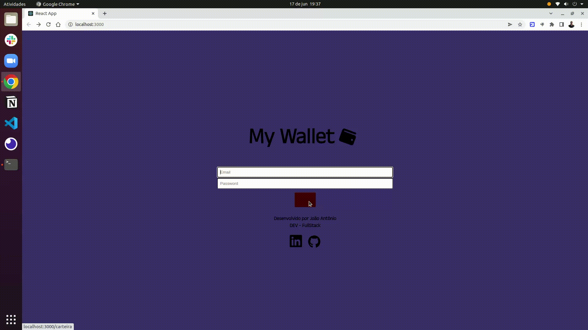
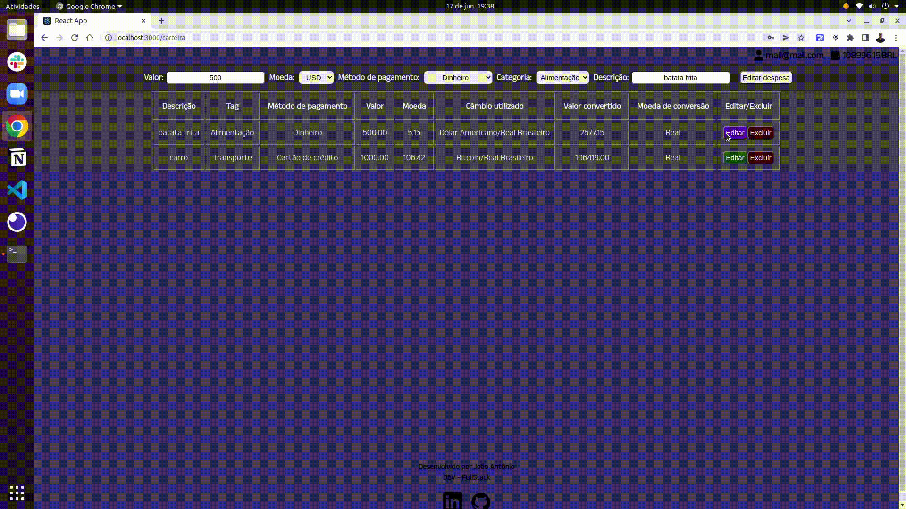

# My Wallet

# O que é o My Wallet

Este projeto é uma carteira de controle de gastos com um conversor de moedas, proporcionando ao usuário um ambiente em que pode: 
    - Adicionar, remover e editar seus gastos;
    - Visualizar uma tabela com a descrição de seus gastos;
    - Visualizar o total dos seus gastos convertidos para BRL (Real Brasileiro)

## Técnologias usadas

Front-end:
> Desenvolvido usando: React, Redux, CSS3, HTML5, ES6


## Instalando Dependências

> Basta executar o comando abaixo no seu terminal
```bash
npm install
``` 

## Executando aplicação
* Para rodar a aplicação execute:

  ```
  npm start
  ```

## Gifs de demonstração do projeto
- Login e adicionando despesas


- Editando e excluindo despesas



Este projeto foi desenvolvido por [João Antônio](https://www.linkedin.com/in/joaoantoniosilvaa/) durante o curso de Desenvolvimento de Software na [Trybe](https://www.betrybe.com/) 